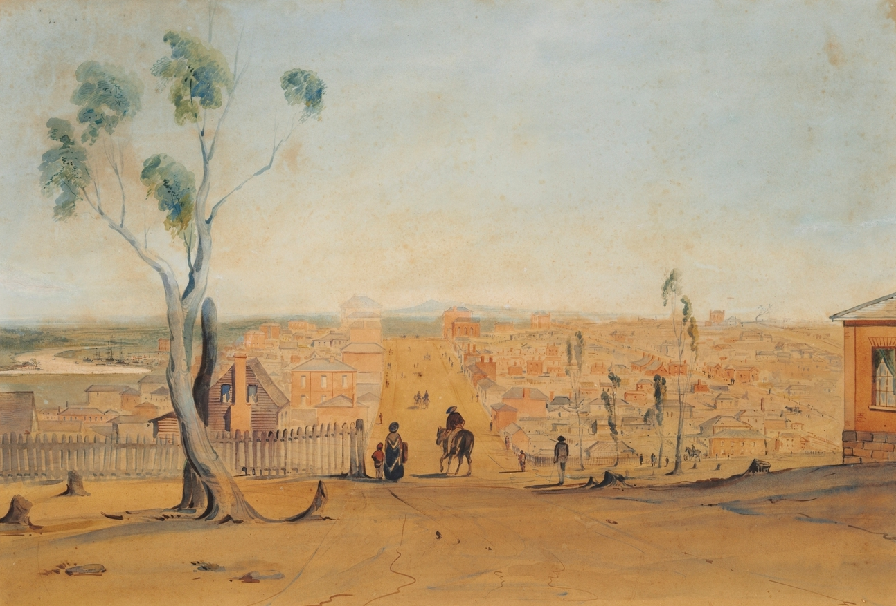

	

	<h2 class="section-heading text-uppercase">Conference Colours</h2>

**OUR CONFERENCE LOGO**

Our fantastic conference logo was designed by Madeline Flynn, a scientific illustrator from [QIMR Berghofer](https://www.qimrb.edu.au/).

**COLOUR PALETTE**

	

The logo colour palette is based on [Robert Russell](https://en.wikipedia.org/wiki/Robert_Russell_(architect))'s painting ["Melbourne from eastern end of Collins Street"](https://archival.sl.nsw.gov.au/Details/archive/110339405) painted in 1841. The palette was originally drawn from the [ochRe](https://github.com/hollylkirk/ochRe/) package.

  

    

      

        

        

          <code>#a8c0a8</code>
        

      

    

    

      

        

        

          <code>#c0c0a8</code>
        

      

    

    

      

        

        

          <code>#a8a890</code>
        

      

    

    

      

        

        

          <code>#909078</code>
        

      

    

    

      

        

        

          <code>#a8a8a8</code>
        

      

    

  

  

    

      

        

        

          <code>#c0c0c0</code>
        

      

    

    

      

        

        

          <code>#d8c0a8</code>
        

      

    

    

      

        

        

          <code>#c09048</code>
        

      

    

    

      

        

        

          <code>#c07848</code>
        

      

    

    

      

        

        

          <code>#d89060</code>
        

      

    

  

  

    

      R Colour Vector
      <button
        class="btn btn-sm btn-outline-secondary"
        onclick="copyToClipboard()"
        id="copy-btn"
      >
        <svg xmlns="http://www.w3.org/2000/svg" width="16" height="16" fill="currentColor" class="bi bi-clipboard me-1" viewBox="0 0 16 16">
          <path d="M4 1.5H3a2 2 0 0 0-2 2V14a2 2 0 0 0 2 2h10a2 2 0 0 0 2-2V3.5a2 2 0 0 0-2-2h-1v1h1a1 1 0 0 1 1 1V14a1 1 0 0 1-1 1H3a1 1 0 0 1-1-1V3.5a1 1 0 0 1 1-1h1v-1z"/>
          <path d="M9.5 1a.5.5 0 0 1 .5.5v1a.5.5 0 0 1-.5.5h-3a.5.5 0 0 1-.5-.5v-1a.5.5 0 0 1 .5-.5h3zm-3-1A1.5 1.5 0 0 0 5 1.5H3.5A1.5 1.5 0 0 0 2 3h12a1.5 1.5 0 0 0-1.5-1.5H11A1.5 1.5 0 0 0 9.5 0h-3z"/>
        </svg>
        Copy
      </button>
    

    

      <pre class="m-0 p-3" id="code-block"><code>mccrea = c(
  "#a8c0a8",
  "#c0c0a8",
  "#a8a890",
  "#909078",
  "#a8a8a8",
  "#c0c0c0",
  "#d8c0a8",
  "#c09048",
  "#c07848",
  "#d89060",
)</code></pre>
    

  

